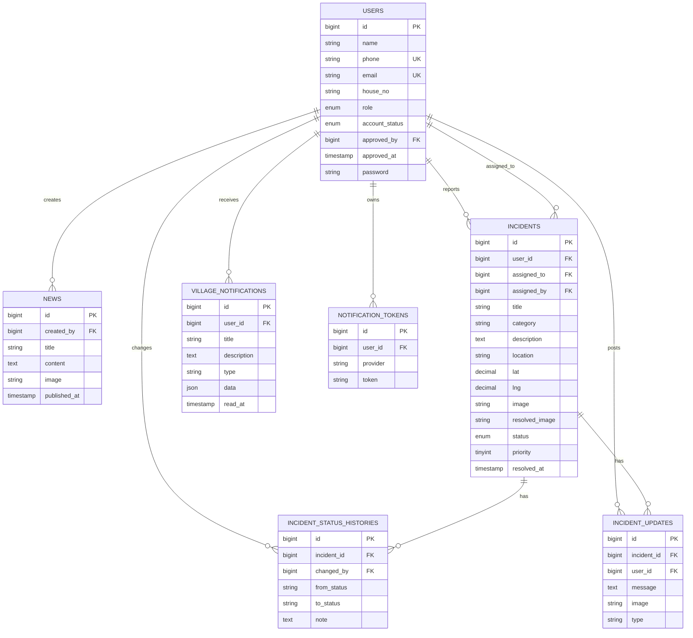

# แผนภาพความสัมพันธ์ฐานข้อมูล (ER Diagram)

```mermaid
erDiagram
    USERS ||--o{ NEWS : creates
    USERS ||--o{ INCIDENTS : reports
    USERS ||--o{ INCIDENTS : assigned_to
    USERS ||--o{ INCIDENT_STATUS_HISTORIES : changes
    USERS ||--o{ INCIDENT_UPDATES : posts
    USERS ||--o{ VILLAGE_NOTIFICATIONS : receives
    USERS ||--o{ NOTIFICATION_TOKENS : owns
    INCIDENTS ||--o{ INCIDENT_STATUS_HISTORIES : has
    INCIDENTS ||--o{ INCIDENT_UPDATES : has

    USERS {
        bigint id PK
        string name
        string phone UK
        string email UK
        string house_no
        enum role
        enum account_status
        bigint approved_by FK
        timestamp approved_at
        string password
    }
    NEWS {
        bigint id PK
        bigint created_by FK
        string title
        text content
        string image
        timestamp published_at
    }
    INCIDENTS {
        bigint id PK
        bigint user_id FK
        bigint assigned_to FK
        bigint assigned_by FK
        string title
        string category
        text description
        string location
        decimal lat
        decimal lng
        string image
        string resolved_image
        enum status
        tinyint priority
        timestamp resolved_at
    }
    INCIDENT_STATUS_HISTORIES {
        bigint id PK
        bigint incident_id FK
        bigint changed_by FK
        string from_status
        string to_status
        text note
    }
    INCIDENT_UPDATES {
        bigint id PK
        bigint incident_id FK
        bigint user_id FK
        text message
        string image
        string type
    }
    VILLAGE_NOTIFICATIONS {
        bigint id PK
        bigint user_id FK
        string title
        text description
        string type
        json data
        timestamp read_at
    }
    NOTIFICATION_TOKENS {
        bigint id PK
        bigint user_id FK
        string provider
        string token
    }
```

ตารางระบบของ Laravel ที่ใช้งานร่วมกัน ได้แก่ `personal_access_tokens`, `password_reset_tokens`, `sessions`, `cache` และ `jobs`
