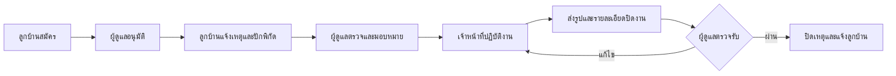

# การออกแบบระบบบริหารจัดการหมู่บ้าน SmartVillage

## วัตถุประสงค์

1. ให้ลูกบ้านแจ้งเหตุพร้อมรายละเอียด รูปภาพ และพิกัดจริงได้
2. ให้ผู้ดูแลตรวจสอบ มอบหมาย ติดตาม และออกรายงานได้
3. ให้เจ้าหน้าที่หน้างานรับงาน อัปเดตความคืบหน้า และส่งรูปปิดงานได้
4. ลดการติดตามงานผ่านเอกสารหรือการสื่อสารที่ตรวจสอบย้อนหลังไม่ได้

## ผู้ใช้งานและสิทธิ์

| บทบาท | ความสามารถหลัก |
|---|---|
| ลูกบ้าน | สมัครสมาชิก รออนุมัติ เข้าสู่ระบบด้วยเบอร์โทร แจ้งเหตุ ติดตามสถานะ อ่านข่าว แก้ข้อมูลกู้คืนบัญชี |
| เจ้าหน้าที่ | ดูงานที่ได้รับมอบหมาย เริ่มงาน เพิ่มบันทึก/รูปภาพ ส่งงานให้ผู้ดูแลตรวจ |
| ผู้ดูแลระบบ | อนุมัติสมาชิก จัดการผู้ใช้ ข่าว เหตุ มอบหมายงาน ตรวจรับงาน ดูสถิติ และส่งออก PDF/Excel |

## ขั้นตอนหลักของระบบ

## ขอบเขตเชิงหน้าที่

- สมัครสมาชิกและอนุมัติบัญชี (`pending`, `approved`, `rejected`, `suspended`)
- เข้าสู่ระบบด้วยเบอร์โทรศัพท์และกู้รหัสผ่านทางอีเมล
- จัดการข่าวพร้อมรูปภาพ
- แจ้งเหตุพร้อมหมวดหมู่ รายละเอียด สถานที่ พิกัด และภาพประกอบ
- ค้นหา กรองตามหมวดหมู่ สถานะ และช่วงวันที่
- มอบหมายเจ้าหน้าที่ บันทึกประวัติสถานะ และตรวจรับงาน
- แจ้งเตือนภายในระบบและรองรับการต่อ Firebase Push Notification
- Dashboard สถิติและรายงาน PDF/Excel
- รองรับคอมพิวเตอร์ แท็บเล็ต และโทรศัพท์

## ข้อกำหนดที่ไม่ใช่หน้าที่

- รหัสผ่านเก็บด้วยการแฮช ไม่เก็บข้อความจริง
- API สำคัญต้องตรวจ token บทบาท และสถานะบัญชี
- จำกัดชนิด/ขนาดไฟล์ และตรวจข้อมูลทุกครั้งที่ Backend
- ใช้ HTTPS เมื่อเปิดออนไลน์
- สำรองฐานข้อมูลและไฟล์รูปภาพเป็นประจำ
- บันทึกผู้ดำเนินการและเวลาเพื่อการตรวจสอบย้อนหลัง

## เทคโนโลยี

Frontend ใช้ React, Vite และ Tailwind CSS; Backend ใช้ Laravel และ Laravel Sanctum; ฐานข้อมูลใช้ MySQL; แผนที่ปัจจุบันใช้ Leaflet/OpenStreetMap; ระบบอีเมลรองรับ Gmail SMTP; Push Notification เตรียมโครงสร้างสำหรับ Firebase Cloud Messaging
